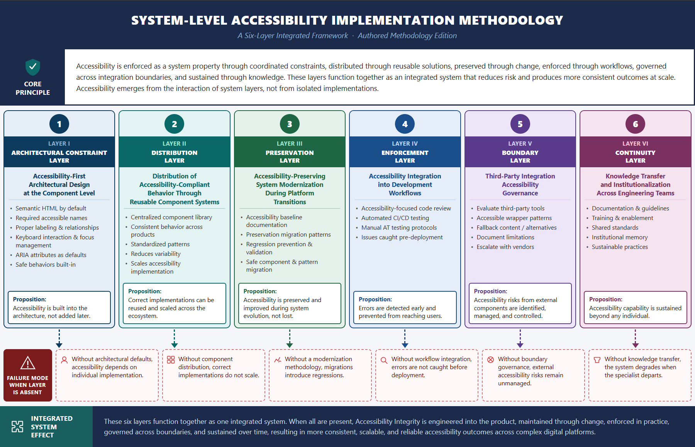

# System-Level Accessibility

A six-layer engineering framework for building scalable, enforceable accessibility in modern web applications.

---

## Overview

Modern accessibility practices often focus on component correctness and compliance with guidelines. While important, these approaches do not reliably prevent accessibility failures in large-scale systems.

This project presents a system-level approach:

> Accessibility is not a property of individual components.  
> It is a property of the system, shaped by how architecture, workflows, and teams operate together.

The framework defines six layers that collectively enforce accessibility across the system.

---

## The Six Layers

1. **Architectural Constraint Layer** — Accessibility built into component design and system foundations  
2. **Distribution Layer** — Accessible behavior reused and scaled across teams  
3. **Preservation Layer** — Accessibility maintained through migrations and system changes  
4. **Enforcement Layer** — Accessibility integrated into development workflows and CI/CD  
5. **Boundary Layer** — Accessibility risks managed across third-party integrations  
6. **Continuity Layer** — Accessibility knowledge sustained across teams and over time  

---

## What This Repository Contains

This repository focuses on **practical implementation** of system-level accessibility:

### 📘 Engineering Framework
→ [`framework/v1-engineering-framework.md`](./framework/v1-framework.md)

A full implementation guide covering:
- architecture patterns  
- workflow integration  
- migration strategy  
- governance and knowledge systems  

---

### ⚙️ Scaled Implementation Guides

Adaptations of the framework for different team sizes:

- [`scaled/solo-developers.md`](./scaled/solo-dev.md)  
- [`scaled/startups.md`](./scaled/startups.md)  
- [`scaled/growing-teams.md`](./scaled/growing-teams.md)  

These guides focus on **progressive adoption** with reduced overhead.

---

## Downloadable Versions

PDF versions of the framework are available:

- [Engineering Framework (PDF)](./framework/system-level-accessibility-framework-v1.pdf)  
- [Scaled Implementation Guides (PDF)](./scaled/system-level-accessibility-scaled-editions.pdf)

---

### 🧩 Reference Implementation

A working component implementation demonstrating accessibility enforcement patterns:

→ https://github.com/tushig11/roqn-ui

This includes:
- enforced accessible naming  
- constrained component APIs  
- accessibility-by-default behavior  

---

## Model Overview

*Accessibility emerges from the interaction of system layers, not from isolated implementations.*

---

## Related Writing

This work is supported by a multi-part article series exploring system-level accessibility:

1. **Why Accessible Components Don’t Guarantee Accessible Systems**  
   https://www.designsystemscollective.com/why-accessible-components-dont-guarantee-accessible-systems-e276d4036e9a  

2. **When Interfaces Change Without Telling You**  
   https://www.designsystemscollective.com/when-interfaces-change-without-telling-you-48ee332a2825  

3. **The Parts Work. The System Doesn’t.**  
   https://www.designsystemscollective.com/the-parts-work-the-system-doesnt-9e78cae24ca5

4. **Where Accessibility Begins**  
   https://www.designsystemscollective.com/where-accessibility-begins-708aa79cc440

5. **What Survives Change**  
   https://medium.com/design-systems-collective/what-survives-change-7dde7adb6d8b

6. **What the System Cannot Control** *(forthcoming)*  

---

## Notes

This repository presents the engineering framework and implementation guidance for system-level accessibility, with a focus on practical adoption across different team sizes.

A formal methodology edition further refines the underlying model and defines accessibility as a system-level property enforced through coordinated constraints.

---

## License

MIT

---

## Disclaimer

This project presents a generalized engineering framework based on industry practices and does not include or disclose any proprietary systems, confidential information, or internal implementation details from any specific organization.
